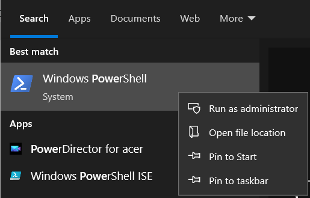
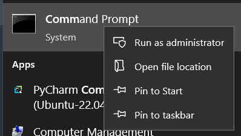
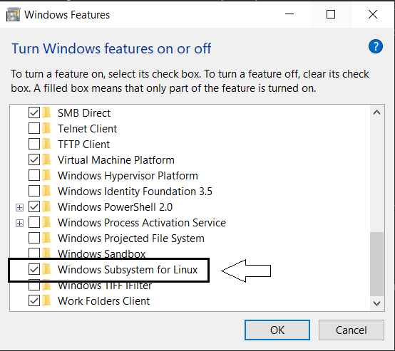
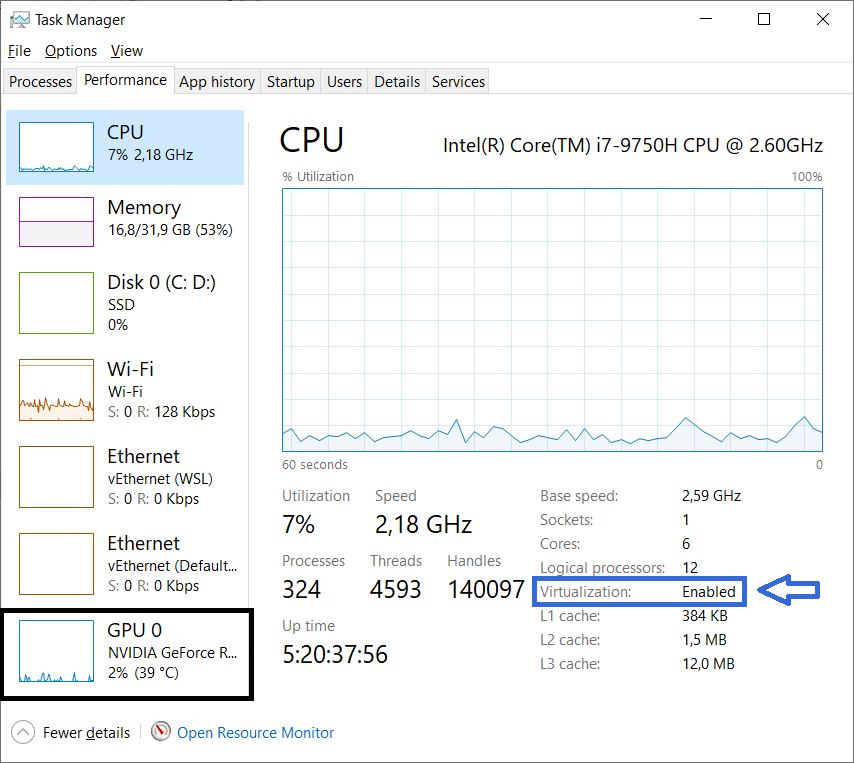

---
# Feel free to add content and custom Front Matter to this file.
# To modify the layout, see https://jekyllrb.com/docs/themes/#overriding-theme-defaults

layout: home
---

This workshop introduces learners to the automatic text recognition (ATR) tool suite "[Loghi](https://github.com/knaw-huc/loghi)". This collection of tools can be used locally, i.e., without uploading data to a foreign server or a cloud service, which may not be an option for projects with stricter data protection guidelines.

The workshop will briefly introduce ATR and its capabilities and limitations. Afterwards, learners will be introduced to Loghi's command-line interface, and we will practice using a previously trained model to recognise text, prepare our data for training, and utilise it to train a new model.

## When & Where? 

2024-09-24, 9:00 - 11:30 at DSC-Oasen, Georg Sverdrups hus, University of Oslo Library

**Registration and more info at: [https://www.ub.uio.no/english/libraries/dsc/berut/events/workshops/2024-09-24_ws_loghi.html](https://www.ub.uio.no/english/libraries/dsc/berut/events/workshops/2024-09-24_ws_loghi.html)**

## Preliminary Lesson Plan
_Please note that the slides may still undergo small changes until a few days before the workshop._

0. Welcome and introductions
1. Introduction to Automatic Text Recognition (ATR) - [Slides](https://raphaelaheil.github.io/2024-09-24-uio-local_atr/slides/01.pdf)
2. Setting up _Loghi_ with Docker - [Slides](https://raphaelaheil.github.io/2024-09-24-uio-local_atr/slides/02.pdf)
3. Using a pre-trained model to recognise text - [Slides](https://raphaelaheil.github.io/2024-09-24-uio-local_atr/slides/03.pdf)
5. Creating training data from existing annotations - [Slides](https://raphaelaheil.github.io/2024-09-24-uio-local_atr/slides/04.pdf)
6. Fine-Tuning and using a small custom model - [Slides](https://raphaelaheil.github.io/2024-09-24-uio-local_atr/slides/05.pdf)
7. Final questions and wrapping up


## Docker Installation Instructions

After the installation, Docker Desktop may prompt you to login/create a user account. This is **not** required in order to use Docker and you can therefore skip this step! 


## Mac
Follow the instructions at: [https://docs.docker.com/desktop/install/mac-install/ ](https://docs.docker.com/desktop/install/mac-install/)

**Note that the installation varies slightly, depending on whether your Mac is using and Intel or Apple Silicon chip!**


## Linux

On Linux, you can either install the command-line based Docker Engine by itself: [https://docs.docker.com/engine/install/](https://docs.docker.com/engine/install/), or integrated within the graphical user interface Docker Desktop [https://docs.docker.com/desktop/install/linux-install/](https://docs.docker.com/desktop/install/linux-install/)

Both versions will work fine for this workshop! 


## Windows

Before you can install Docker Desktop, a number of prerequisites have to be fulfilled. Note that the images below were taken on Windows 10 and may look slightly different if you are working with Windows 11. The respective options should be the same, however! 

### Install the Windows Subsystem for Linux (WSL)
1. Open the PowerShell in **administrator** mode, by searching for the programm in the `Windows Start Menu` (start typing PowerShell to see search results). Right-click on the menu entry and choose "Run as administrator". 

_if PowerShell is not available, look for "Command Prompt" instead and follow the same steps_






2. Enter the command below and press `Enter`.
	```
	wsl --install
	```
3. Once the installation is complete, restart your computer.


### Enable the WSL Windows Feature
1. In the `Windows Start Menu`, search for: "Turn Windows Features on or off" by starting to type the name. 
2. In the new window, scroll all the way to the bottom and ensure that the box for "Windows Subsystem for Linux" is **ticked**




### Ensure that Virtualization is Enabled
1. Open the Task Manager, e.g. by searching for it in the `Windows Start Menu` or right-clicking the task bar and selecting Task Manager in the menu
2. At the top, navigate to the Performance tab
3. Check that Virtualization is set to Enabled

**If Virtualization is Disabled, talk to your administrator (if any) or follow these instructions: [https://support.microsoft.com/en-gb/windows/enable-virtualization-on-windows-c5578302-6e43-4b4b-a449-8ced115f58e1](https://support.microsoft.com/en-gb/windows/enable-virtualization-on-windows-c5578302-6e43-4b4b-a449-8ced115f58e1)**




While you are looking at the Task Manager, you can also check whether your machine has a Graphics Processing Unit (GPU), in the list on the left. This information will be relevant during the workshop. 


### Continue with the Docker Desktop Installation

1. Go to: [https://docs.docker.com/desktop/install/windows-install/](https://docs.docker.com/desktop/install/windows-install/)
2. Download the "Docker Desktop for Windows - x86_64" installer by clicking on the button. Take note of where you have saved the file!
3. Follow the instructions in the section "Install Interactively": [https://docs.docker.com/desktop/install/windows-install/#install-interactively](https://docs.docker.com/desktop/install/windows-install/#install-interactively) 
	- if prompted, select the WSL 2 backend 

**Note: if you encounter any issues during the installation, restart your machine and start the Docker installer again** 


